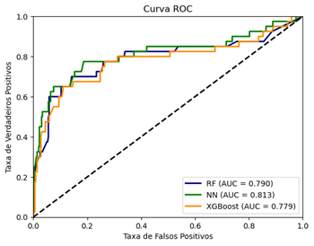

# AutoSAO
Automatização de análise de textos longos de ordens de manutenção SAP com uso de diversas técnicas de embedding diferentes.

Neste repositório estão contidos códigos associados ao [artigo](https://github.com/ThomasAndarilho/AutoSAO/blob/main/Artigo.pdf), que contém a comparação do desempenho de diversas técnicas de embedding na tarefa de classificação automática de textos.
A seguir serão apresentados os scripts de processamento de texto utilizados para gerar os dados que servirão de base para as simulações contidas no [notebook principal](https://github.com/ThomasAndarilho/AutoSAO/blob/main/main.ipynb)

Este projeto visa automatizar a classificação de textos com treinamento supervisionado de modelos de inteligência artificial. Existem diversas técnicas consolidadas de classificação de dados numéricos e essas técnicas podem ser utilizadas na classificação uma vez que estes sejam convertidos para vetores de números. A tarefa de conversão de textos para vetores não é trivial e existem diversas metodologias para fazer isso desde a contagem de palavras até técnicas baseadas na arquitetura Transformer, como um serviço de embedding criado pela OpenAI, que também foi utilizado no presente trabalho. No repositório estão contidos os códigos utilizados para gerar o embedding de textos de ordens de manutenção para sua classificação.

## Índice

- [TF-IDF](#tf-idf)
- [GPT](#gpt)
- [BERTimbau](#bertimbau)
- [SBERT](#sbert)
- [Petrolês](#petrolês)
- [Simulações](#simulações)
- [Curvas_ROC](#curvas_roc)
- [Métricas](#métricas)

### TF-IDF

Para realizar o cálculo da matriz TF-IDF, foi utilizado o script [TF-IDF.py](https://github.com/ThomasAndarilho/AutoSAO/blob/main/TF-IDF.py).
Esse script utiliza como entrada o arquivo dados.csv, em particular a coluna de texto longo e realiza diversas técnicas de NLP, a saber: eliminação de nulos, tokenização, remoção de *stopwords*, *stemming*. Ao final é utilizada a classe [TfidfVectorizer](https://scikit-learn.org/stable/modules/generated/sklearn.feature_extraction.text.TfidfVectorizer.html) da biblioteca sklearn para criar a matriz a partir dos dados tratados.
Para utilizar o script, é necessário apontar o caminho do arquivo de dados na linha 12.
O script gera como saída os seguintes arquivos com conjuntos de treino e teste: TF-IDF_X_train.xlsx, TF-IDF_X_test.xlsx, TF-IDF_y_train.xlsx e TF-IDF_y_test.xlsx.

### GPT

As ferramentas de NLP da OpenAI que utilizam a arquitetura Transformers representam um grande avanço na área de processamento de linguagem natural, no entanto o uso de informações corporativas dentro dessa ferramenta pode gerar vazamento de dados (como o relatado na [Forbes](https://www.forbes.com/sites/siladityaray/2023/05/02/samsung-bans-chatgpt-and-other-chatbots-for-employees-after-sensitive-code-leak/?sh=643fc8526078)) uma vez que o conteúdo das mensagens pode ser utilizado para o treinamento de versões futuras do modelo.
Com objetivo de evitar esse risco, a PETROBRAS, em parceria com a Microsoft, criou um serviço interno com tecnologia OpenAI chamado [ChatPetrobras](https://www.linkedin.com/posts/fernando-castelloes-436878107_chatpetrobras-ia-generativa-acess%C3%ADvel-a-activity-7113709745651298304-lWug?trk=public_profile_like_view). Dentro desses serviços foram disponibilizadas diversas APIs, inclusive a de embedding mais avançada da OpenAI, o [text-embedding-ada-002](https://openai.com/blog/new-and-improved-embedding-model).
Para realizar esse embedding foi utilizado o script [GPT.py](https://github.com/ThomasAndarilho/AutoSAO/blob/main/GPT.py).
Para utilizar o script, é necessário estar conectado à intranet PETROBRAS e são necessários os arquivos "config.ini" e "petrobras-ca-root.pem", que foram omitidos do presente repositório por conter informações sensíveis. Também é necessário apontar o caminho do arquivo de dados na linha 86.
O script gera como saída o arquivo gpt.xlsx.

### BERTimbau

O BERT (*Bidirectional Encoder Representations from Transformers*), da Google é um exemplo de engenho baseado na arquiterura Transformers. Esse modelo foi treinado e disponibilizado pela Google, no entanto essa versão disponibilizada foi treinada no idioma inglês. Para permitir aplicações no inioma Português brasileiro, a empresa [NeuralMind.ai](https://neuralmind.ai/bert/) fez um *fine tunning* do BERT. Esse modelo foi carinhosamente apelidado de BERTimbau, e disponibilizado sob o código "bert-base-portuguese-cased" através da biblioteca "transformers" do [Hugging Face](https://huggingface.co/neuralmind/bert-base-portuguese-cased).
Foram gerados embeddings com esse modelo através do script [BERTimbau.py](https://github.com/ThomasAndarilho/AutoSAO/blob/main/BERTimbau.py).
Para utilizar o script, é necessário apontar o caminho do arquivo de dados na linha 19. Um fato relevante sobre esse modelo, é que ele gera um embedding por token. Para obter o embedding da sentença foi tirada a média dos vetores de embedding através da função torch.mean() da biblioteca PyTorch
O script gera como saída o arquivo BERT.xlsx.

### SBERT

Também foi utilizada uma versão do BERT modificada para o embedding de sentenças, o [SBERT](https://www.sbert.net/). Dentro da biblioteca sentence_transformers foram utilizados dois modelos poliglotas diferentes aplicados nos scripts [SBERT_v1.py](https://github.com/ThomasAndarilho/AutoSAO/blob/main/SBERT_v1.py) e [SBERT_v2.py](https://github.com/ThomasAndarilho/AutoSAO/blob/main/SBERT_v2.py).
Para utilizar os scripts, é necessário apontar o caminho do arquivo de dados na linha 11.
Os scripts geras como saídas os arquivos sbert_v1.xlsx e sbert_v2.xlsx.

### Petrolês

O Petrolês é uma iniciativa de colaboração interinstitucional liderada pelo Centro de Pesquisas e Desenvolvimento da Petrobras (CENPES), em parceria com PUC-Rio, UFRGS e PUC-RS, e visa incentivar pesquisas nas áreas de Processamento de Linguagem Natural e Linguística Computacional aplicadas ao domínio de O&G. Em sua [página pública](https://petroles.puc-rio.ai/) são disponibilizados diversos modelos treinados a partir dos corpora especializados nos domínios de Óleo e Gás (O&G). Foram utilizados três modelos do tipo Word2vec em três scripts distintos, a saber:
- O script [Petroles_H_100.py](https://github.com/ThomasAndarilho/AutoSAO/blob/main/Petroles_H_100.py) utiliza o modelo [Petrovec-híbrido (Word2vec) 100](https://petroles.puc-rio.ai/files/embeddings/Petrovec_Hibrido_Word2vec.zip) e gera como saída o arquivo petroles.xlsx.
- O script [Petroles_O&G_100.py](https://github.com/ThomasAndarilho/AutoSAO/blob/main/Petroles_O%26G_100.py) utiliza o modelo [Petrovec-O&G (Word2vec) 100](https://petroles.puc-rio.ai/files/embeddings/Petrovec_OeG_Word2vec.zip) e gera como saída o arquivo petroles_o&g_100.xlsx.
- O script [Petroles_O&G_300.py](https://github.com/ThomasAndarilho/AutoSAO/blob/main/Petroles_O%26G_300.py) utiliza o modelo [Petrovec-O&G (Word2vec) 300](https://petroles.puc-rio.ai/files/embeddings/PetroVEC_OeG_Word2vec_300d.zip) e gera como saída o arquivo petroles_o&g_300.xlsx.
Para utilizar cada um dos scripts, é necessário baixar e descompactar os modelos disponíveis na [página pública](https://petroles.puc-rio.ai/) e apontar o diretório onde os arquivos descompactados estão na linha 30 dos scripts. Também é necessário apontar caminho do arquivo de dados na linha 48.

### Simulações

Os dados gerados pelo processamento de textos com os scripts supracitados são utilizados para treinar três tipos diferentes de modelos: Random Forest (RF), Redes Neurais (do inglês "Neural Networks" - NN), e XGBoost.
Os códigos utilizados para essas simulações estão contidos no notebook [main.ipynb](https://github.com/ThomasAndarilho/AutoSAO/blob/main/main.ipynb).
Para executar com sucesso o código contido nesse notebook, é necessário que ele esteja na mesma pasta que os arquivos .xlsx gerados por cada um dos scripts supracitados.
As interpretações, conclusões e referências estão contidas no arquivo [Artigo.pdf](https://github.com/ThomasAndarilho/AutoSAO/blob/main/Artigo.pdf)

### Curvas_ROC

| Técnica de embedding | Dados originais                                            | *Data augmentation*                                        |
| :------------------: | :--------------------------------------------------------: | :--------------------------------------------------------: |
| GPT                  |                            |                            |
| BERTimbau            |                |                |
| Petrolês híbrido 100 |  |  | 
| Petrolês O&G 100     |    |    | 
| Petrolês O&G 300     |    |    | 
| SBERT v1             |                   |                   | 
| SBERT v2             |                   |                   | 

### Métricas

| Embedding        | A | Model   | TN  | FP | FN | TP | p_1  | r_1  | f1_1 | f1_acc | AUC_ROC |
| ---------------- | - | ------- | --- | -- | -- | -- | ---- | ---- | ---- | ------ | ------- |
| TF-IDF           | N | RF      | 349 | 10 | 23 | 17 | 0,63 | 0,42 | 0,51 | 0,92   | 0,809   |
| TF-IDF           | S | RF      | 331 | 28 | 18 | 22 | 0,44 | 0,55 | 0,49 | 0,88   | 0,799   |
| GPT              | N | RF      | 353 | 6  | 31 | 9  | 0,6  | 0,23 | 0,33 | 0,91   | 0,789   |
| GPT              | N | NN      | 355 | 4  | 32 | 8  | 0,67 | 0,2  | 0,31 | 0,91   | 0,772   |
| GPT              | N | XGBoost | 355 | 9  | 28 | 12 | 0,57 | 0,3  | 0,39 | 0,91   | 0,765   |
| GPT              | S | RF      | 348 | 11 | 23 | 17 | 0,61 | 0,42 | 0,5  | 0,91   | 0,794   |
| GPT              | S | NN      | 340 | 19 | 21 | 19 | 0,5  | 0,47 | 0,49 | 0,9    | 0,769   |
| GPT              | S | XGBoost | 340 | 19 | 21 | 19 | 0,5  | 0,47 | 0,49 | 0,9    | 0,789   |
| Bertimbau        | N | RF      | 354 | 5  | 33 | 7  | 0,58 | 0,17 | 0,27 | 0,9    | 0,735   |
| Bertimbau        | N | NN      | 355 | 4  | 33 | 7  | 0,64 | 0,17 | 0,27 | 0,91   | 0,733   |
| Bertimbau        | N | XGBoost | 354 | 5  | 30 | 10 | 0,67 | 0,25 | 0,36 | 0,91   | 0,743   |
| Bertimbau        | S | RF      | 348 | 11 | 28 | 12 | 0,52 | 0,3  | 0,38 | 0,9    | 0,741   |
| Bertimbau        | S | NN      | 272 | 87 | 17 | 23 | 0,21 | 0,57 | 0,31 | 0,74   | 0,717   |
| Bertimbau        | S | XGBoost | 341 | 18 | 27 | 13 | 0,42 | 0,33 | 0,37 | 0,89   | 0,716   |
| Petrolês H 100   | N | RF      | 345 | 14 | 23 | 17 | 0,55 | 0,42 | 0,48 | 0,91   | 0,816   |
| Petrolês H 100   | N | NN      | 352 | 7  | 24 | 16 | 0,7  | 0,4  | 0,51 | 0,92   | 0,823   |
| Petrolês H 100   | N | XGBoost | 343 | 16 | 23 | 17 | 0,52 | 0,42 | 0,47 | 0,9    | 0,816   |
| Petrolês H 100   | S | RF      | 322 | 37 | 14 | 26 | 0,41 | 0,65 | 0,5  | 0,87   | 0,79    |
| Petrolês H 100   | S | NN      | 300 | 59 | 11 | 29 | 0,33 | 0,72 | 0,45 | 0,82   | 0,813   |
| Petrolês H 100   | S | XGBoost | 325 | 34 | 16 | 24 | 0,41 | 0,6  | 0,49 | 0,87   | 0,779   |
| Petrolês O&G 100 | N | RF      | 346 | 13 | 25 | 15 | 0,54 | 0,38 | 0,44 | 0,9    | 0,811   |
| Petrolês O&G 100 | N | NN      | 351 | 8  | 26 | 14 | 0,64 | 0,35 | 0,45 | 0,91   | 0,793   |
| Petrolês O&G 100 | N | XGBoost | 343 | 16 | 23 | 17 | 0,52 | 0,42 | 0,47 | 0,9    | 0,806   |
| Petrolês O&G 100 | S | RF      | 332 | 27 | 17 | 23 | 0,46 | 0,57 | 0,51 | 0,89   | 0,817   |
| Petrolês O&G 100 | S | NN      | 265 | 94 | 9  | 31 | 0,25 | 0,78 | 0,38 | 0,74   | 0,796   |
| Petrolês O&G 100 | S | XGBoost | 327 | 32 | 17 | 23 | 0,42 | 0,57 | 0,48 | 0,88   | 0,806   |
| Petrolês O&G 300 | N | RF      | 344 | 15 | 25 | 15 | 0,5  | 0,38 | 0,43 | 0,9    | 0,839   |
| Petrolês O&G 300 | N | NN      | 352 | 6  | 26 | 14 | 0,7  | 0,35 | 0,47 | 0,92   | 0,815   |
| Petrolês O&G 300 | N | XGBoost | 342 | 17 | 23 | 17 | 0,5  | 0,42 | 0,46 | 0,9    | 0,805   |
| Petrolês O&G 300 | S | RF      | 331 | 28 | 15 | 25 | 0,47 | 0,62 | 0,54 | 0,89   | 0,806   |
| Petrolês O&G 300 | S | NN      | 267 | 92 | 12 | 28 | 0,23 | 0,7  | 0,35 | 0,74   | 0,777   |
| Petrolês O&G 300 | S | XGBoost | 323 | 36 | 19 | 21 | 0,37 | 0,53 | 0,43 | 0,86   | 0,8     |
| SBERT v1         | N | RF      | 352 | 7  | 31 | 9  | 0,56 | 0,23 | 0,32 | 0,9    | 0,794   |
| SBERT v1         | N | NN      | 354 | 5  | 30 | 10 | 0,67 | 0,25 | 0,36 | 0,91   | 0,798   |
| SBERT v1         | N | XGBoost | 347 | 12 | 27 | 13 | 0,52 | 0,33 | 0,4  | 0,9    | 0,782   |
| SBERT v1         | S | RF      | 343 | 16 | 24 | 16 | 0,5  | 0,4  | 0,44 | 0,9    | 0,788   |
| SBERT v1         | S | NN      | 331 | 28 | 20 | 20 | 0,42 | 0,5  | 0,45 | 0,88   | 0,817   |
| SBERT v1         | S | XGBoost | 340 | 19 | 23 | 17 | 0,47 | 0,42 | 0,45 | 0,89   | 0,805   |
| SBERT v2         | N | RF      | 353 | 6  | 30 | 10 | 0,62 | 0,25 | 0,36 | 0,91   | 0,77    |
| SBERT v2         | N | NN      | 354 | 5  | 29 | 11 | 0,69 | 0,28 | 0,39 | 0,91   | 0,822   |
| SBERT v2         | N | XGBoost | 351 | 8  | 27 | 13 | 0,62 | 0,33 | 0,43 | 0,91   | 0,789   |
| SBERT v2         | S | RF      | 345 | 14 | 25 | 15 | 0,52 | 0,38 | 0,43 | 0,9    | 0,813   |
| SBERT v2         | S | NN      | 312 | 47 | 16 | 24 | 0,34 | 0,6  | 0,43 | 0,84   | 0,802   |
| SBERT v2         | S | XGBoost | 342 | 17 | 22 | 18 | 0,51 | 0,45 | 0,48 | 0,9    | 0,785   |

- **Embedding**: Método utilizado para conversão de uma sentença em um vetor numérico.
- **A**: *Augmentation*. Neste caso, de forma a amenizar o desbalanceamento de classes, foi utilizado SMOTE.
- **Model**: Modelo utilizado para classificação, sendo Random Forest (RF), Redes neurais (NN) ou XGBoost.
- **TN**: Verdadeiros negativos.
- **FP**: Falsos positivo.
- **FN**: Falsos negativos.
- **TP**: Verdadeiros positivos.
- **p_1**: Precisão para a classe 1.
- **r_1**: Recall para a classe 1.
- **f1_1**: F1 score para a classe 1.
- **f1_acc**: F1 score para a acurácia.
- **AUC_ROC**: Área sob a curva ROC.
